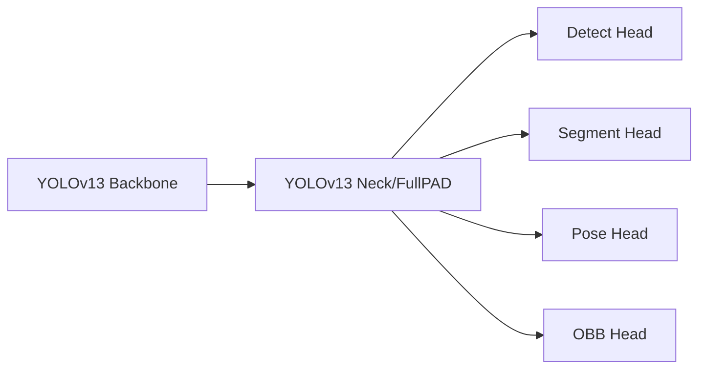

# 02 Architecture Plan

## Goal

Extend YOLOv13 family to support three task heads while preserving v13 backbone/neck advantages.

## Strategy

1. Keep YOLOv13 backbone + neck unchanged.
2. Add task-specific head variants for:
   - Segment
   - Pose
   - OBB
3. Mirror Ultralytics v8/v11 task conventions for compatibility.

## Model Config Deliverables

- `ultralytics/cfg/models/v13/yolov13-seg.yaml`
- `ultralytics/cfg/models/v13/yolov13-pose.yaml`
- `ultralytics/cfg/models/v13/yolov13-obb.yaml`

Optional scale wrappers:

- `yolov13n-seg.yaml`, `yolov13s-seg.yaml`, `yolov13l-seg.yaml`, `yolov13x-seg.yaml`
- `yolov13n-pose.yaml`, `yolov13s-pose.yaml`, `yolov13l-pose.yaml`, `yolov13x-pose.yaml`
- `yolov13n-obb.yaml`, `yolov13s-obb.yaml`, `yolov13l-obb.yaml`, `yolov13x-obb.yaml`

## High-Level Flow

## Non-Functional Requirements

- No regression on detect task.
- DDP-safe on 2xT4.
- Export behavior documented per task.
- Repeatable results via pinned env/tooling.
