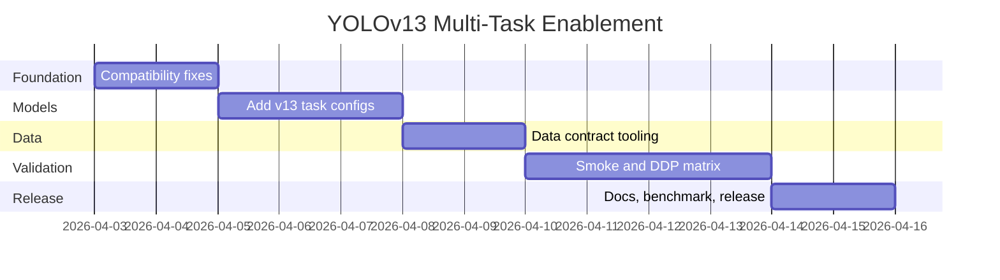

# 03 Execution Plan

## Phases

### Phase 1 - Compatibility and Correctness

- Align OBB metrics keys/results behavior.
- Add preflight checks for task-specific dataset schemas.
- Verify no detect regression.

Current status:

- Step 1 complete: OBB metrics key alignment fix drafted and tracked in `roadmap/PHASE1_STATUS.md`.

### Phase 2 - v13 Task Model Definitions

- Implement v13 segment/pose/obb YAMLs.
- Add scale variants and naming conventions.
- Validate model construction + shape sanity.

### Phase 3 - Data Contracts and Tooling

- Define strict dataset requirements per task.
- Provide conversion scripts/templates where needed.
- Add explicit error messaging for invalid labels.

### Phase 4 - Validation Matrix

- Smoke train/val/predict on tiny datasets:
  - Seg: `coco8-seg`
  - Pose: `coco8-pose`
  - OBB: `dota8`
- DDP smoke on 2xT4 per task.

### Phase 5 - Export and Runtime

- Validate export support per task (`onnx`, `engine` where applicable).
- Verify postprocessing consistency in inference.

### Phase 6 - Documentation and Release

- Add user docs for each task.
- Add troubleshooting section mapped to known issues.
- Publish benchmark and acceptance report.

## Timeline View

