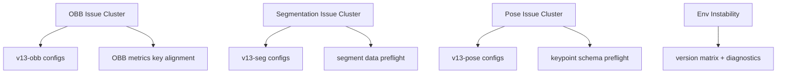

# 05 Issue Mapping

## Objective

Map recurring community issues to concrete engineering actions.

## Mapped Issues

- OBB support confusion and runtime errors (e.g. issue threads similar to #62, #74)
  - Action: add v13-obb configs + examples + OBB metric compatibility fix.

- Segmentation setup errors (e.g. issue threads similar to #62, #72)
  - Action: add v13-seg configs + dataset schema validator + one-command smoke script.

- Pose dataset/keypoint schema errors (e.g. issue threads similar to #75)
  - Action: enforce `kpt_shape` validation, add clear docs for multi-instance labels.

- Environment/precision instability reports
  - Action: publish recommended env matrix, lock tested versions, provide diagnostic script.

## Traceability Matrix

