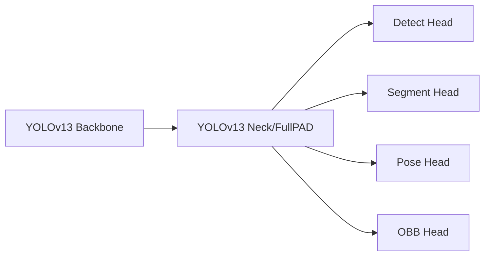
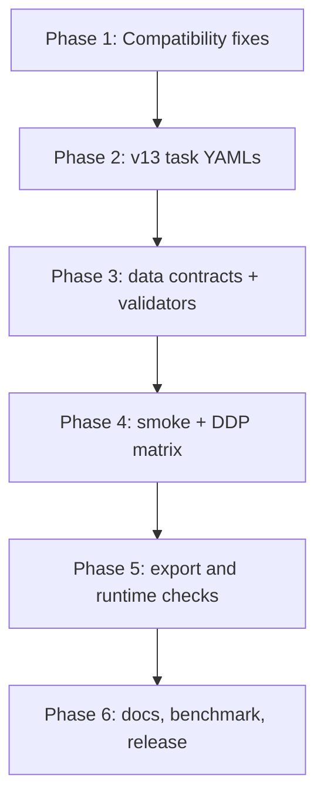
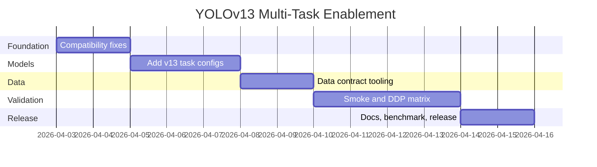
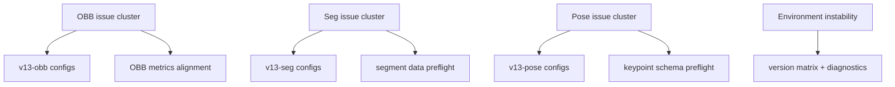

# YOLOv13 Multi-Task Master Roadmap

## Objective

Enable production-grade YOLOv13 support for:

- Pose Estimation
- Instance Segmentation
- Oriented Bounding Boxes (OBB)

in the custom fork while preserving detect-task stability.

## Current-State Summary

- Both upstream and custom fork already include Ultralytics multi-task plumbing:
  - task map entries for `segment`, `pose`, `obb`
  - task trainers/validators/predictors
  - task model classes (`SegmentationModel`, `PoseModel`, `OBBModel`)
  - dataset pipeline flags for masks/keypoints/obb
- YOLOv13 family is currently practical detect-first in model configs.
- Missing piece: v13-native task model configs and fully validated release path.
- Known issue cluster from community indicates docs/config/metrics friction for OBB/Pose/Seg.

## Architecture Direction

Keep YOLOv13 backbone + neck and add task-specific heads using established Ultralytics conventions.

## Required Deliverables

### 1) Model Configs

- Base task configs:
  - `ultralytics/cfg/models/v13/yolov13-seg.yaml`
  - `ultralytics/cfg/models/v13/yolov13-pose.yaml`
  - `ultralytics/cfg/models/v13/yolov13-obb.yaml`
- Optional scale wrappers per task (`n/s/l/x`) for consistent UX.

### 2) Correctness Fixes

- Align OBB metrics key/value outputs in `ultralytics/utils/metrics.py`.
- Add task-specific preflight validation and clear failure messages.

Status:

- OBB metrics key alignment: in progress (Phase 1 step implemented).

### 3) Data Contracts

- Seg: polygons/masks schema and empty-object behavior.
- Pose: `kpt_shape`, visibility conventions, multi-instance labeling.
- OBB: angle convention (`xywhr`), conversion requirements (e.g., DOTA-style).

### 4) Validation + QA Matrix

- Smoke train/val/predict for each task:
  - Seg: `coco8-seg`
  - Pose: `coco8-pose`
  - OBB: `dota8`
- DDP smoke on 2xT4 for all tasks.
- Export checks (`onnx`, `engine`) with support notes.

### 5) Release Assets

- Repro scripts + pinned env matrix.
- Metrics/artifacts bundle (plots, logs, checkpoints).
- Updated docs and troubleshooting mapped to real issue patterns.

## Phased Execution Plan

## Specs to Author

- `SPEC-10-v13-task-heads.md`
- `SPEC-11-data-contracts.md`
- `SPEC-12-validation-matrix.md`
- `SPEC-13-release-gates.md`

## Knowledge Prerequisites

- Ultralytics task internals and trainer lifecycle.
- Dataset conversion and annotation QA for seg/pose/obb.
- DDP behavior and mixed precision on T4.
- Export constraints per task.

## Issue-to-Action Mapping

## Acceptance Criteria

- [ ] v13 seg/pose/obb configs load and train in smoke mode.
- [ ] Detect baseline remains stable.
- [ ] DDP smoke passes on 2xT4 for all tasks.
- [ ] OBB/pose/seg metrics and callbacks are consistent.
- [ ] Predict/val/export paths are validated and documented.
- [ ] Docs include quickstarts, dataset format, troubleshooting, and limits.

## Folder Index

- `roadmap/01_assessment.md`
- `roadmap/02_architecture_plan.md`
- `roadmap/03_execution_plan.md`
- `roadmap/04_specs.md`
- `roadmap/05_issue_mapping.md`
- `roadmap/06_acceptance_checklists.md`
