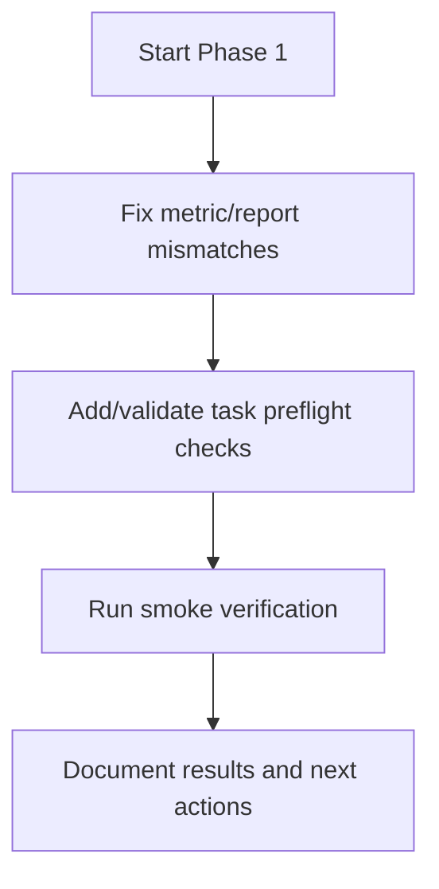

# Phase 1 Status Log

## Scope

Phase 1 focuses on compatibility and correctness fixes before adding new v13 task heads.

## Progress

### Step 1 - OBB metrics compatibility fix

- File updated: `ultralytics/utils/metrics.py`
- Change:
  - `OBBMetrics.keys` now includes `metrics/mAP75(B)`
  - key count now matches `Metric.mean_results()` shape used by OBB pipeline
- Why:
  - Prevent key/value mismatch in `results_dict` and downstream callback/report consumers

## Phase 1 Workflow

## Next Steps

1. Add task preflight validation checks for segment/pose/obb datasets.
2. Run smoke verification checklist for correctness.
3. Update roadmap/specs with completed evidence and artifacts.
