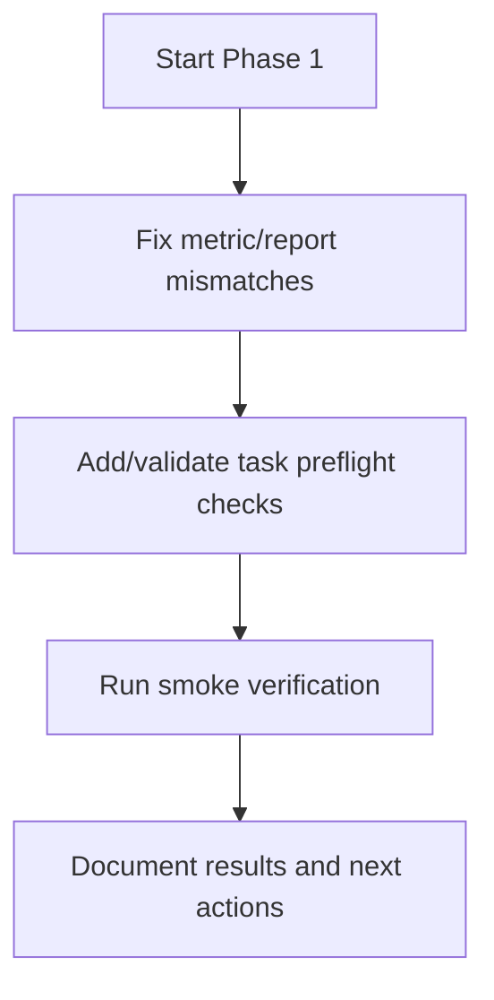
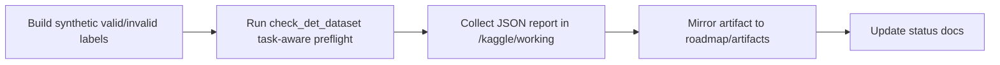

# Phase 1 Status Log

## Scope

Phase 1 focuses on compatibility and correctness fixes before adding new v13 task heads.

## Progress

### Step 1 - OBB metrics compatibility fix

- File updated: `ultralytics/utils/metrics.py`
- Change:
  - `OBBMetrics.keys` now includes `metrics/mAP75(B)`
  - key count now matches `Metric.mean_results()` shape used by OBB pipeline
- Why:
  - Prevent key/value mismatch in `results_dict` and downstream callback/report consumers

### Step 2 - Task preflight validation wiring

- File updated: `ultralytics/data/utils.py`
- Added:
  - `_sample_label_files(...)`
  - `_validate_task_label_schema(data, task)`
  - `check_det_dataset(..., task=None)` now accepts task context and runs task-specific schema preflight
- File updated: `ultralytics/engine/trainer.py`
  - pass `task=self.args.task` into `check_det_dataset(...)`
- File updated: `ultralytics/engine/validator.py`
  - pass `task=self.args.task` into `check_det_dataset(...)`
- File updated: `ultralytics/models/yolo/world/train_world.py`
  - pass `task=self.args.task` into dataset checks

Preflight behavior summary:

- `segment`: sampled label rows must look like polygon rows (odd token count, minimum 7).
- `pose`: requires valid `kpt_shape` and exact token count (`5 + nkpt * ndim`).
- `obb`: sampled label rows must look like corner-based OBB rows (odd token count, minimum 9).

## Phase 1 Workflow

## Next Steps

1. Phase 1 complete. Begin Phase 2 (v13 task-head model configs).

## Phase 1 Completion

- Compatibility fix: OBB metrics keys aligned.
- Task-aware preflight checks: integrated into trainer/validator/world paths.
- Smoke evidence: 6/6 checks passed.
- Ready to proceed to model-config implementation phase.

### Step 3 - Smoke harness prepared

- File added: `kaggle/scripts/33_phase1_task_preflight_smoke.py`
- Purpose:
  - programmatically verify that preflight checks pass valid samples and fail malformed samples for
    `segment`, `pose`, and `obb`.
- Output artifact:
  - `/kaggle/working/phase1_preflight_smoke/phase1_task_preflight_smoke.json`

### Step 3 - Smoke harness executed

- Run environment: Kaggle Linux 2xT4 machine
- Result summary:
  - total cases: 6
  - ok: 6
  - mismatch: 0
- Artifact mirrored to repo:
  - `roadmap/artifacts/phase1_task_preflight_smoke.json`

