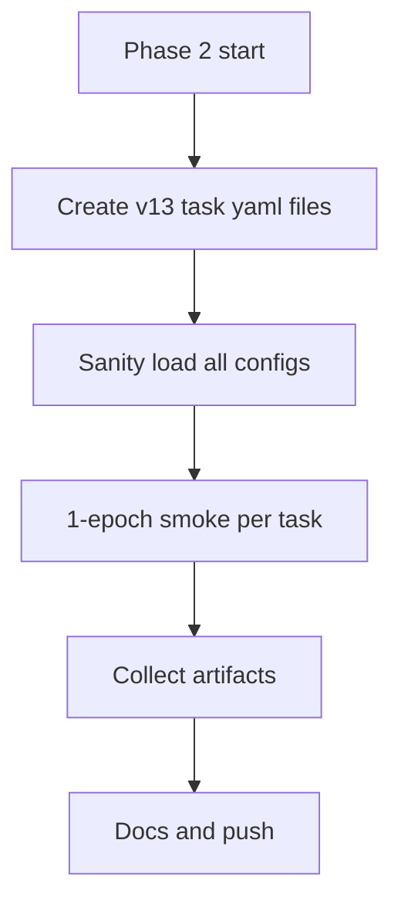

# Phase 2 Plan - YOLOv13 Task Head Configs

## Objective

Add YOLOv13-native model configs for:

- Instance Segmentation
- Pose Estimation
- OBB

while keeping detect behavior unchanged.

## Entry Criteria (met)

- Phase 1 compatibility fixes are merged on `new_arch`.
- Preflight smoke harness passes with 0 mismatches.
- Detect model load sanity remains successful.

## Work Breakdown

1. Add base task YAMLs under `ultralytics/cfg/models/v13/`:
   - `yolov13-seg.yaml`
   - `yolov13-pose.yaml`
   - `yolov13-obb.yaml`
2. Add scale wrappers (`n/s/l/x`) for each task.
3. Run model construction sanity for all new configs.
4. Run short smoke train (1 epoch) per task on tiny datasets.
5. Capture artifacts and update roadmap/spec docs.

## Execution Flow

## Deliverables

- New v13 task config files.
- Smoke run evidence report.
- Updated roadmap/spec status files.

## Decision Log

- Chosen path: ship safe `n/s/l/x` first.
- `m` and `xl` are deferred because initial validation showed channel-shape incompatibilities that require deeper graph retuning.
- Turing FlashAttention compatibility principle preserved (no head changes that alter flash backend selection logic).
