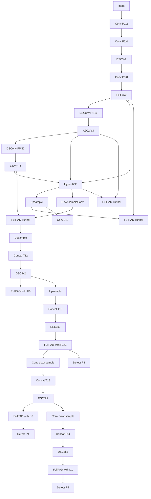
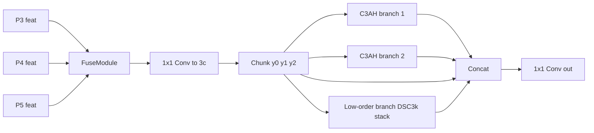
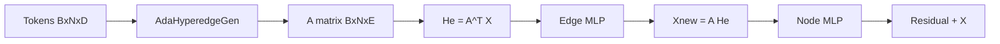
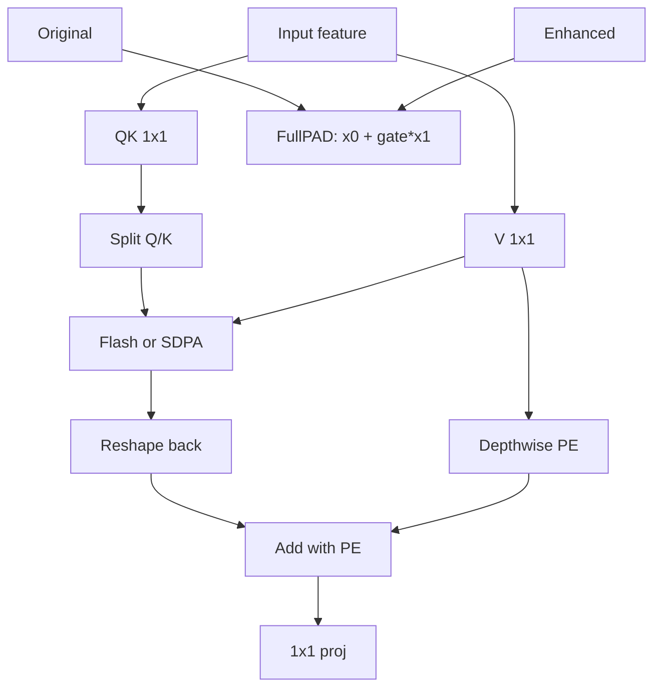
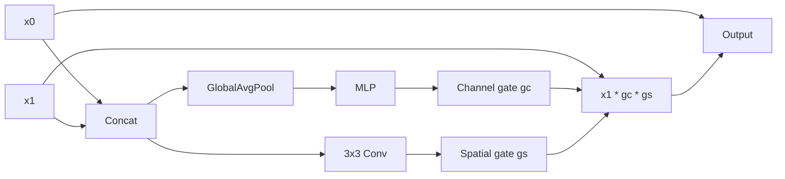
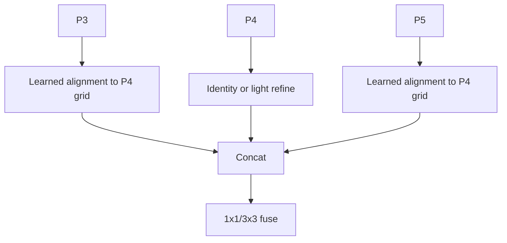
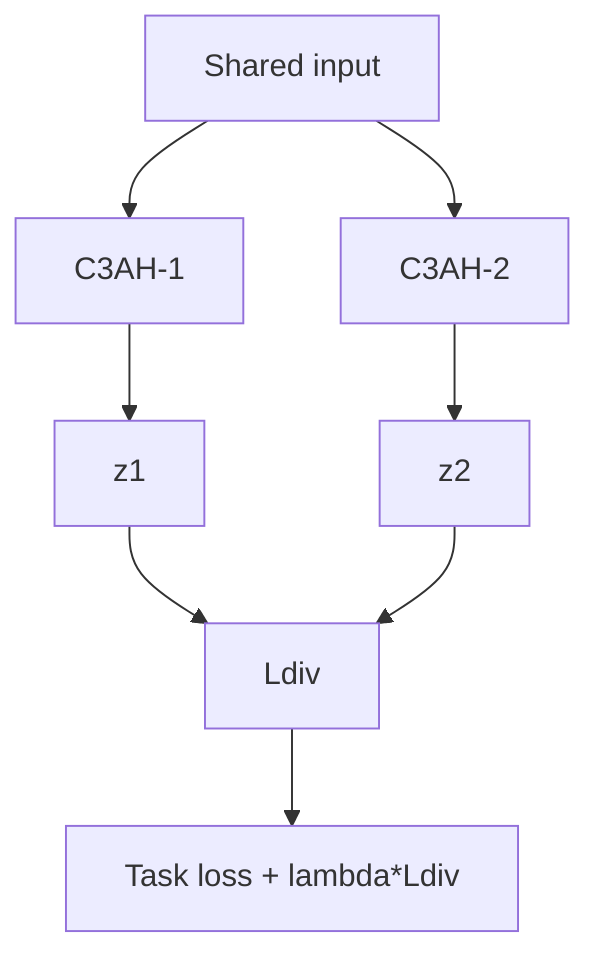
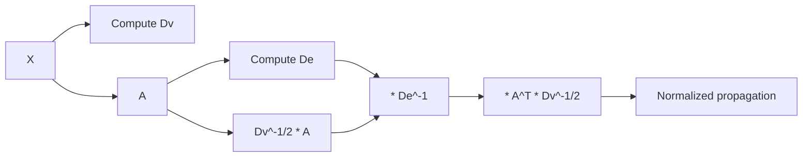
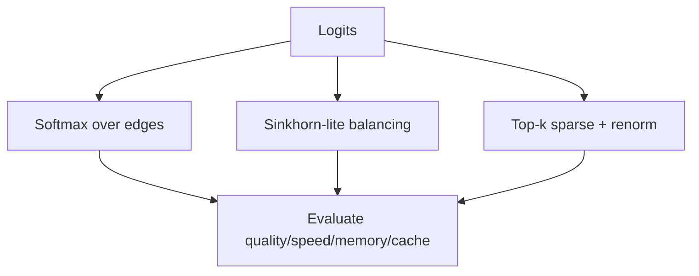

# YOLOv13 Architecture and Mathematical Enhancement Plan

## Scope and intent
This document analyzes the current YOLOv13 architecture in this repository and proposes a dense, engineering-oriented upgrade plan (YOLOv13-v2).

Focus:
- architecture changes
- mathematical formulation changes
- expected impact on memory, speed, and quality
- expected KV cache hit/loss behavior in attention-heavy paths

References in this codebase:
- `ultralytics/cfg/models/v13/yolov13_2.yaml`
- `ultralytics/nn/modules/block.py`
- `ultralytics/nn/modules/conv.py`

---

## 1) Current YOLOv13 architecture (as implemented)

### 1.1 Macro graph

### 1.2 HyperACE internals

### 1.3 Adaptive hypergraph flow

Current equations:
- `A = softmax(logits, dim=1)`
- `He = A^T X`
- `Xnew = A He`
- `Y = MLP(Xnew) + X`

### 1.4 AAttn and FullPAD

---

## 2) Core weaknesses to improve

### 2.1 Scalar FullPAD gate is under-expressive
Current fusion uses one scalar parameter for all channels and all spatial locations.

Cons:
- cannot adaptively suppress noisy channels
- cannot spatially route where enhancement is useful

### 2.2 Fusion alignment is too static
`FuseModule` currently uses avgpool/nearest before concat.

Cons:
- no learned offset/alignment
- misalignment error is pushed downstream

### 2.3 HyperACE dual C3AH branch redundancy risk
Two high-order branches ingest near-identical signals.

Cons:
- branches can collapse to correlated representations
- capacity is spent without guaranteed diversity

### 2.4 Hypergraph propagation lacks explicit normalization
Current propagation does not explicitly normalize by node/edge degree matrices.

Cons:
- output scale varies with sequence length and assignment density
- stability can degrade across scale/augmentation regimes

### 2.5 Assignment normalization axis is hard to interpret
Current `softmax(..., dim=1)` normalizes across nodes.

Cons:
- per-edge competition behavior is less direct
- harder to tune sparsity and load balancing

### 2.6 No anti-collapse regularizers for edge usage
No explicit penalties to avoid dead edges or over-dominant edges.

Cons:
- lower effective hypergraph capacity
- higher run-to-run variability

### 2.7 P3/P4/P5 only detection
No optional P2 path in default design.

Con:
- tiny-object recall ceiling on some datasets

### 2.8 AAttn policy still coarse
Even with shape-safe improvements, precision/kernel policy is mostly binary by backend availability.

Con:
- not fully optimized for stability/locality tradeoffs

---

## 3) Proposed YOLOv13-v2 changes

### 3.1 Adaptive FullPAD gating (channel/spatial)

#### Proposed architecture

#### Math effect
- moves fusion from rank-1 scalar modulation to channel/spatial-conditioned modulation
- better signal routing and reduced underfitting in neck fusion

#### Expected impact
- Memory: +1% to +3%
- Throughput: -1% to -3%
- Accuracy robustness: positive
- KV cache hits/losses: near-neutral (not direct QKV path)

### 3.2 Alignment-aware multi-scale fusion

#### Proposed architecture

#### Math effect
- reduces aliasing and phase mismatch before high-order modeling
- improves coherence entering HyperACE

#### Expected impact
- Memory: +3% to +8%
- Throughput: -3% to -8%
- Accuracy: moderate gain
- KV cache hits/losses: small gain from less corrective attention work

### 3.3 Branch diversity regularization in HyperACE

#### Proposed training graph

#### Math effect
- encourages complementary high-order features
- prevents branch collapse

#### Expected impact
- Memory: ~0 runtime
- Throughput: ~0 to -1% training
- Quality: positive on complex scenes
- KV cache hits/losses: neutral

### 3.4 Degree-normalized hypergraph convolution

#### Proposed equations
- `Dv(i,i)=sum_e A(i,e)`
- `De(e,e)=sum_i A(i,e)`
- `Xnew = Dv^(-1/2) A De^(-1) A^T Dv^(-1/2) X W`

#### Graph view

#### Math effect
- better-conditioned propagation operator
- lower scale drift across token counts

#### Expected impact
- Memory: +2% to +5%
- Throughput: -2% to -5%
- Stability: strong gain
- KV cache hits/losses: slight raw overhead possible, but better effective utilization via fewer unstable iterations

### 3.5 Assignment strategy upgrade

#### Candidate strategies

#### Math effect
- better assignment interpretability
- sparse routing can improve efficiency and specialization

#### Expected impact
- Memory: -10% to +5% (top-k vs Sinkhorn)
- Throughput: +5% to -6%
- Accuracy: often positive with proper regularization
- KV cache hits/losses: top-k sparse usually increases hit ratio and reduces cache losses

### 3.6 Hyperedge usage regularizers

#### Suggested losses
- entropy term on assignments
- batch-level edge load balancing
- dead-edge penalty

#### Ma

---

## 8) Implementation status (phase 1)

Implemented in codebase:

- Adaptive FullPAD fusion:
  - `FullPAD_Tunnel` upgraded from scalar-only residual to scalar-scaled channel/spatial adaptive gating.
- Hypergraph routing upgrades:
  - `AdaHyperedgeGen` now supports `normalize` in `{node, edge, sinkhorn}`.
  - Optional sparse routing with `topk` masking and renormalization.
- Degree-normalized propagation:
  - `AdaHGConv` now supports degree-normalized incidence and configurable fallback.
- Module plumbing:
  - `AdaHGComputation`, `C3AH`, `HyperACE` signatures extended to pass `normalize`, `topk`, `degree_norm`.
  - `parse_model` logic in `ultralytics/nn/tasks.py` updated accordingly.
- YAML defaults:
  - New v13 _2 YAML variants carry upgraded defaults (`normalize="edge"`, `topk=0`, `degree_norm=True`) while base YAMLs stay unchanged.

Files touched in phase 1:

- `ultralytics/nn/modules/block.py`
- `ultralytics/nn/tasks.py`
- `ultralytics/cfg/models/v13/yolov13_2.yaml`
- `ultralytics/cfg/models/v13/yolov13s_2.yaml`
- `ultralytics/cfg/models/v13/yolov13l_2.yaml`
- `ultralytics/cfg/models/v13/yolov13x_2.yaml`

Not yet implemented (phase 2+):

- alignment-aware FuseModule replacement
- explicit HyperACE branch-diversity loss wiring in training objective
- optional P2 detection-head profile
- AAttn windowed-policy path
