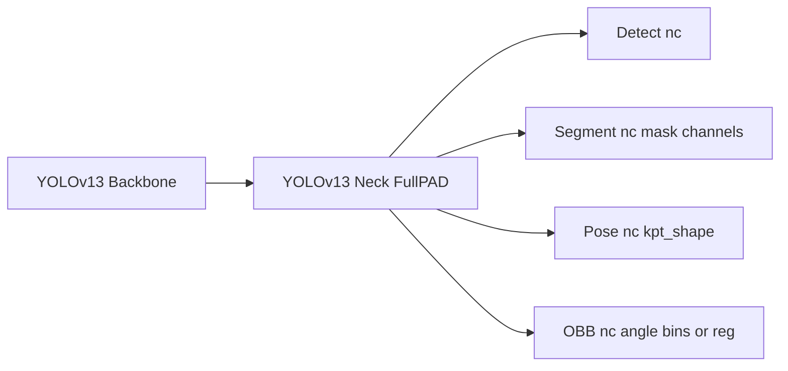

# SPEC-10: YOLOv13 Task Heads

## Purpose

Define how YOLOv13 will support `segment`, `pose`, and `obb` tasks while preserving the existing v13 backbone/neck behavior.

## Scope

- Add v13 task model YAMLs.
- Reuse existing Ultralytics task heads (`Segment`, `Pose`, `OBB`).
- Keep detect path backward-compatible.

## Deliverables

1. `ultralytics/cfg/models/v13/yolov13-seg.yaml`
2. `ultralytics/cfg/models/v13/yolov13-pose.yaml`
3. `ultralytics/cfg/models/v13/yolov13-obb.yaml`
4. Optional scale wrappers for `n/s/l/x` per task.

## Design

## Compatibility Constraints

- `model.task_map` remains unchanged (`detect`, `segment`, `pose`, `obb` already present).
- `DetectionModel` parse/stride behavior must remain valid for all task heads.
- Existing v13 detect checkpoints keep loading without migration scripts.

## Acceptance

- Task YAMLs instantiate with `YOLO(<yaml>)`.
- 1-epoch smoke train succeeds for each task.
- Detect baseline smoke still passes.
